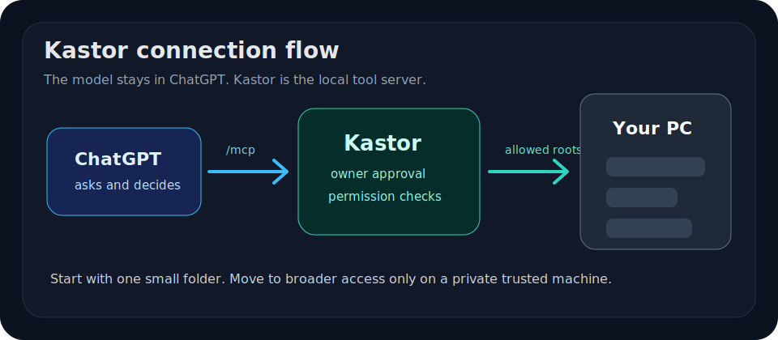
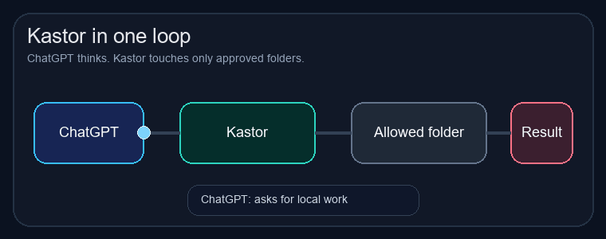
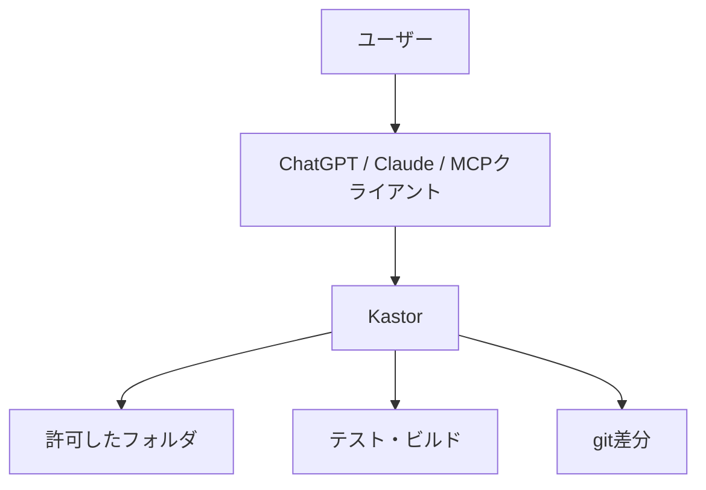

# Kastor

Kastorは、ChatGPTやClaudeのようなMCP対応クライアントに、このPC上の許可したフォルダを触らせるためのローカルサーバーです。

AI本体ではありません。考えるのはChatGPTやClaudeで、KastorはPC側の手足です。ファイルを読む、編集する、検索する、テストを走らせる、gitの差分を見る、といった作業をMCPツールとして渡します。

英語版: [README.md](README.md)






## 何ができるか

- 許可したフォルダのファイルを読む
- コードを編集する
- `grep`、`glob`、`ls`で探す
- テストやビルドを実行する
- gitの差分を見る
- commit前の確認をする
- 作業計画、チェックポイント、レビュー用のメモを残す
- 必要ならWindowsの画面操作ツールも使う

やっていることは単純です。AIにPCを丸ごと渡すのではなく、あなたが許可した作業場所をMCP越しに渡します。

## 誰向けか

主な対象は、ChatGPT Web版やほかのMCP対応クライアントでも、Codexに近いローカル開発作業をさせたい人です。

たとえば、ChatGPTにこう頼めます。

```text
このリポジトリを見て、READMEのセットアップ手順を直して
```

ChatGPTはKastor経由でフォルダを開き、必要なファイルを読み、編集し、テストを走らせます。

## Codexとの違い

KastorはCodexそのものではありません。

Codexは、モデル、実行環境、作業フローが一体になったエージェント体験です。Kastorはそこまで持ちません。Kastorがやるのは、MCP対応クライアントにローカルPCの作業道具を渡すことです。

ざっくり言うとこうです。



ChatGPTやClaudeが頭で、KastorがPC側の道具箱です。

## 最初のインストール

必要なもの:

- Node.js `>=20.12 <27`
- npm
- Git
- Bash。WindowsならGit Bashで足ります
- ChatGPT Webから使うなら、PCに届く公開HTTPS URL

今の公開版はGitHub Releaseから入れます。

```bash
npm install -g https://github.com/mno-d/kastor/releases/download/v1.0.9/mnod-kastor-1.0.9.tgz
kastor setup-guide
kastor init
kastor doctor
kastor doctor --json
kastor public-check
kastor serve
```

npm本体への公開は、今回の版では使いません。今はGitHub Release版を正とします。

## 初期設定

`kastor init`を実行すると、1つずつ質問されます。

迷ったら、まずは狭く始めてください。

- `project`: 今のプロジェクトだけ。最初はこれが安全
- `projects`: 複数のプロジェクトフォルダ
- `power`: 広いアクセス。自分専用PCで分かっている人向け

公開用の説明やスクリーンショットでは、`project`か`projects`を使ってください。いきなりPC全体を許可する説明は危ないです。

## ChatGPTに渡すURL

KastorはPC上ではこのように動きます。

```text
http://127.0.0.1:7676/mcp
```

ただしChatGPT Webは、あなたのPCの`127.0.0.1`には直接アクセスできません。Cloudflare Tunnel、ngrok、Tailscale Funnelなどで公開HTTPS URLを作ります。

ChatGPTに渡すMCP endpointはこうです。

```text
https://your-domain.example.com/mcp
```

`KASTOR_PUBLIC_BASE_URL`には`/mcp`を付けません。

```text
https://your-domain.example.com
```

接続したら、KastorのOwner password画面で承認します。ツール説明や公開URLを変えた場合は、ChatGPT側でコネクタを再接続してください。

## 安全に使う

Kastorは強い道具です。許可したフォルダ内では、AIがファイルを読み、編集し、コマンドを実行できます。

最初は小さいフォルダだけ許可してください。

良い例:

```text
C:\Users\you\dev\my-project
```

危ない例:

```text
C:\
C:\Users\you
/
~
```

PC全体アクセスは、自分専用PCで、何が起きるか分かっている場合だけにしてください。

公開前には次を実行してください。

```bash
kastor public-check
kastor doctor --json
```

`.env`、`auth.json`、APIキーらしき文字列、広すぎる許可rootなどを確認します。
`doctor --json`は、Node、Git、Bash、SQLite、許可フォルダ、ChatGPTに渡すURLをまとめて出します。困った時はこの結果を見ると、どこで止まっているか分かりやすいです。

## 重要なファイル

Kastorは標準でここに設定を書きます。

```text
~/.kastor/config.json
~/.kastor/auth.json
```

`auth.json`は公開しないでください。接続承認に使うOwner passwordが入ります。

## 詳しい説明

- [docs/setup.ja.md](docs/setup.ja.md)
- [docs/security.ja.md](docs/security.ja.md)
- [docs/public-vs-private.ja.md](docs/public-vs-private.ja.md)
- [docs/chatgpt-web-e2e.ja.md](docs/chatgpt-web-e2e.ja.md)
- [docs/setup.md](docs/setup.md)
- [docs/security.md](docs/security.md)
- [docs/public-vs-private.md](docs/public-vs-private.md)
- [docs/chatgpt-web-e2e.md](docs/chatgpt-web-e2e.md)
- [docs/tunnels.md](docs/tunnels.md)
- [docs/tunnels.ja.md](docs/tunnels.ja.md)
