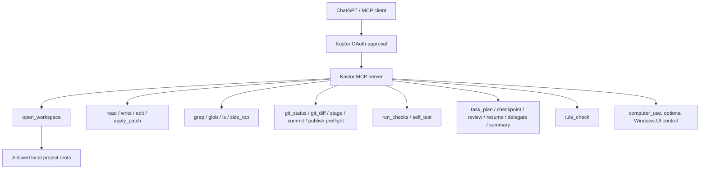

# Kastor

Kastor is a self-hosted MCP server that gives ChatGPT or another MCP-capable host controlled access to local development workspaces.

It started as a DevSpace-compatible local coding harness, then adds a more Codex-like workflow: workspace opening, scoped file tools, patching, git inspection, verification checks, persistent task plans, review packets, resume packets, rule checks, and optional Windows Computer Use.

## What It Is

Kastor is not a separate coding agent. The MCP host remains the reasoning surface. Kastor only exposes explicit local tools.



## Safety Model

Kastor is powerful local-machine access. Treat an approved MCP client like a trusted developer sitting at your PC.

Keep these rules:

- Allow only narrow project folders with `KASTOR_ALLOWED_ROOTS`.
- Never use `C:\`, `/`, or a whole home folder for shared setups.
- Never commit `.env`, `.devspace/auth.json`, owner tokens, tunnel URLs, or machine-specific logs.
- Use a tunnel URL you control, then approve access with the owner password.
- Keep `KASTOR_ALLOWED_HOSTS` specific. Do not use `*` outside debugging.
- Review diffs before commits or publishing.

Public installs should start with one narrow project folder. Widen access only
after you understand what the connected MCP host can do.

## Install

Requirements:

- Node.js `>=20.12 <27`
- npm
- Git
- A public HTTPS tunnel such as ngrok, Cloudflare Tunnel, Pinggy, Tailscale Funnel, or your own reverse proxy

From a clone:

```bash
npm install
npm run build
npm run start
```

Or run the CLI after build:

```bash
node dist/cli.js init
node dist/cli.js setup-guide
node dist/cli.js doctor
node dist/cli.js serve
```

The package exposes both command names for compatibility:

```bash
kastor init
kastor setup-guide
kastor doctor
kastor serve
devspace init
devspace serve
```

## Configuration

Copy `.env.example` to `.env` and adjust it for your machine, or run `kastor init`.

Important values:

```text
KASTOR_ALLOWED_ROOTS=/absolute/path/to/your/projects
KASTOR_PUBLIC_BASE_URL=https://your-tunnel-host.example.com
KASTOR_OAUTH_OWNER_TOKEN=change-me-to-a-long-random-secret
```

`kastor init` asks for a permission preset:

- `project`: current project only. Best first run.
- `projects`: one or more project folders.
- `power`: broader private-machine access. Do not use for public/shared setups.

The MCP endpoint is:

```text
https://your-tunnel-host.example.com/mcp
```

The local health check is:

```text
http://127.0.0.1:7676/healthz
```

## Windows Autostart

The Windows helper scripts are optional. They start Kastor, start a fixed ngrok tunnel, and can optionally open either ChatGPT Desktop or a Chrome app-window fallback for ChatGPT web.

Autostart refuses to install unless you provide a tunnel domain or public base URL:

```powershell
.\scripts\install-kastor-autostart.ps1 `
  -NgrokDomain "your-domain.example.com"
```

Set a narrow allowed root before using the local starter:

```powershell
$env:KASTOR_ALLOWED_ROOTS = "C:\Users\you\Projects"
$env:KASTOR_NGROK_DOMAIN = "your-domain.example.com"
.\scripts\start-kastor-local.ps1
```

Do not start public/shared setups with `C:\`, `/`, or a whole home folder. If
you need broader access for a private machine, set it explicitly in your own
environment and keep that configuration out of published examples.

### ChatGPT Web Fallback

If the Windows ChatGPT Desktop app is broken or unavailable, keep Kastor running and use ChatGPT web as the MCP host. The MCP endpoint stays the same:

```text
https://your-tunnel-host.example.com/mcp
```

For a dedicated Chrome app-window:

```powershell
.\scripts\start-kastor-and-chatgpt.ps1 `
  -NgrokDomain "your-domain.example.com" `
  -ChatGptClient chrome
```

This opens `https://chatgpt.com` in a dedicated Chrome profile. Connect Kastor from ChatGPT connector settings, approve the Kastor owner password, then refresh metadata after tool changes.

## Main Tools

- `open_workspace`: open an allowed local project folder.
- `read`, `write`, `edit`, `apply_patch`: inspect and change files.
- `grep`, `glob`, `ls`, `size_top`: discover code and files.
- `git_status`, `git_diff`, `git_stage`, `git_commit`, `git_publish`: inspect and prepare git work without automatic publishing.
- `run_checks`, `self_test`: run package verification.
- `task_plan`: persist objectives, checkpoints, review packets, resume packets, delegation packets, and summaries.
- `rule_check`: run Codex-style safety gates around risky steps.
- `computer_use`: operate visible Windows apps when normal file/code tools are not enough.

## Before Sharing

Run:

```bash
npm run typecheck
npm test
npm run build
npm pack --dry-run
```

Then check that no private data is tracked:

```bash
git status --short
git grep -n "your-real-token-or-domain"
```

Also inspect:

- `.env`
- `~/.devspace/auth.json`
- logs under `~/.devspace`
- any tunnel URL files

Those files should stay local and untracked.

See [docs/publishing.md](docs/publishing.md) for the full public-release checklist.
See [docs/os-setup.md](docs/os-setup.md) and [docs/tunnels.md](docs/tunnels.md) for platform and tunnel setup.

## Notes

Kastor keeps DevSpace-compatible names and environment variable fallbacks where useful, but new setups should prefer `KASTOR_*` variables and the `kastor` command.
