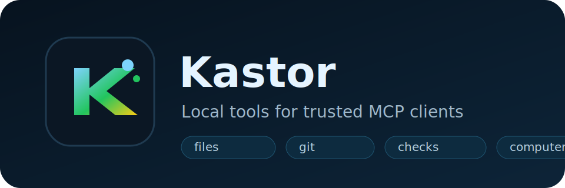
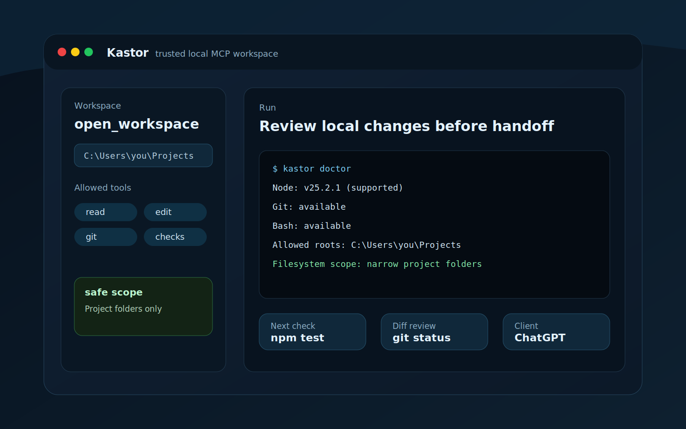
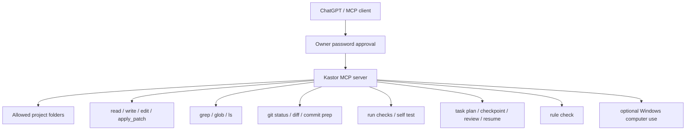

# Kastor



[日本語README](README.ja.md)

Kastor lets ChatGPT, or another MCP client, work with files on your machine.

You choose the folders it can touch. The client can then read files, edit code,
run checks, inspect git changes, and use a few Codex-like workflow tools.

Kastor is not another AI agent. It is the local tool server. The thinking still
happens in ChatGPT or the MCP client you connect.

It is also not Codex itself. Codex is an agent experience with its own runtime.
Kastor is the bridge that gives an MCP-capable client controlled access to your
local files, shell checks, git state, and workflow helpers.





## First Run

Requirements:

- Node.js `>=20.12 <27`
- npm
- Git
- Bash. On Windows, Git Bash is enough.
- A public HTTPS tunnel if ChatGPT needs to reach this PC

Install from the current GitHub release:

```bash
npm install -g https://github.com/mno-d/kastor/releases/download/v1.0.3/mnod-kastor-1.0.3.tgz
kastor setup-guide
kastor init
kastor doctor
kastor doctor --json
kastor serve
```

From a clone:

```bash
npm install
npm run build
node dist/cli.js setup-guide
node dist/cli.js init
node dist/cli.js doctor
node dist/cli.js doctor --json
node dist/cli.js serve
```

Windows users can run:

```powershell
.\scripts\bootstrap-windows.ps1 -RunInit
```

macOS and Linux users can run:

```bash
bash ./scripts/bootstrap-unix.sh --init
```

The MCP endpoint you give to ChatGPT is:

```text
https://your-domain.example.com/mcp
```

`KASTOR_PUBLIC_BASE_URL` should be the origin only:

```text
https://your-domain.example.com
```

## Permissions

Start small.

`kastor init` asks for one of these presets:

- `project`: only the folder you run setup from
- `projects`: one or more project folders
- `power`: broad access on a private machine

For public examples, use `project` or `projects`.

Do not share a setup that allows `C:\`, `/`, or your whole home folder. That is
fine for your own private machine if you know what you are doing. It is a bad
default for anyone else.

If you want full-PC access, make it a private-machine choice. Do not put that in
a tutorial, template, screenshot, or shared config.

## Config Files

Kastor writes local config here by default:

```text
~/.kastor/config.json
~/.kastor/auth.json
```

Keep `auth.json` private. It contains the owner password used when a client asks
to connect.

Kastor still accepts old `DEVSPACE_*` environment variables for compatibility,
but new setups should use `KASTOR_*`.

Important values:

```text
KASTOR_ALLOWED_ROOTS=/absolute/path/to/your/project
KASTOR_PUBLIC_BASE_URL=https://your-domain.example.com
KASTOR_OAUTH_OWNER_TOKEN=change-me-to-a-long-random-secret
```

## Tunnel

ChatGPT cannot reach `127.0.0.1` on your PC. You need a public HTTPS URL that
forwards to Kastor.

Common choices:

- ngrok
- Cloudflare Tunnel
- Tailscale Funnel
- your own reverse proxy

Point the tunnel to:

```text
http://127.0.0.1:7676
```

Then run:

```bash
KASTOR_PUBLIC_BASE_URL=https://your-domain.example.com node dist/cli.js serve
```

See [docs/tunnels.md](docs/tunnels.md) for examples.

## Main Tools

- `open_workspace`: open an allowed project folder
- `read`, `write`, `edit`, `apply_patch`: inspect and change files
- `grep`, `glob`, `ls`, `size_top`: find code and files
- `git_status`, `git_diff`, `git_stage`, `git_commit`, `git_publish`: inspect and prepare git work
- `run_checks`, `self_test`: run verification
- `task_plan`: save objectives, checkpoints, reviews, resume packets, and summaries
- `rule_check`: check risky steps before doing them
- `computer_use`: optional Windows UI control

## Safety

Treat an approved MCP client like a developer sitting at your PC.

- Allow only folders you are willing to expose.
- Review diffs before committing.
- Do not commit `.env`, `~/.kastor/auth.json`, tunnel URLs, or logs.
- Keep `KASTOR_ALLOWED_HOSTS` specific. Do not use `*` outside debugging.
- Use a tunnel URL you control.

## Before Sharing

Run:

```bash
npm run typecheck
npm test
npm run build
npm audit --audit-level=high
kastor public-check
kastor doctor --json
npm pack --dry-run
```

Check for private data:

```bash
git status --short
git grep -n "sk-\\|xoxb\\|ghp_\\|GHp"
```

Also inspect:

- `.env`
- `~/.kastor/auth.json`
- logs under `~/.kastor`
- tunnel URL files

Those files should stay local and untracked.

## npm Name

The plain `kastor` package name has an old unpublished record on npm, so do not
count on it for public publishing.

Use a scoped package name such as:

```text
@mnod/kastor
```

The command can still be `kastor`; the npm package name and CLI command do not
have to match.

## More Docs

- [README.ja.md](README.ja.md)
- [docs/setup.md](docs/setup.md)
- [docs/setup.ja.md](docs/setup.ja.md)
- [docs/os-setup.md](docs/os-setup.md)
- [docs/tunnels.md](docs/tunnels.md)
- [docs/security.md](docs/security.md)
- [docs/security.ja.md](docs/security.ja.md)
- [docs/chatgpt-coding-workflow.md](docs/chatgpt-coding-workflow.md)
- [docs/publishing.md](docs/publishing.md)
